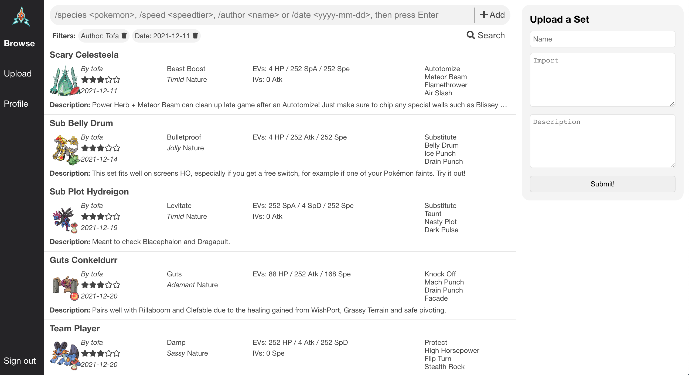

# pokebrowse

A web application for uploading and browsing Pokémon sets.

## How to Run

After setting up a PostgreSQL database [using the provided SQL file](server/src/db/schemas.sql) and performing the necessary [configuration](server/configs/README.md), run the following:

- `npm run build`, then `npm run serve` to start the client
- `npm run start` to start the server
- `npm run startLogin` to start the login server

## Overview

The application provides two services: _browse_ and _upload_.

### Browse

Browsing can be done by anyone, even if they are not signed in, by accessing the `/browser` route on the client (e.g `http://localhost:8080/browser`). To search for sets, first add filters by typing them into the input bar. Then, when you have added the desired filters, click the Search button. The results can then be clicked, providing a popup with the import and full description of the set. The input format for the available filters are:

- `/species <pokemon>`: Allow this Pokémon in the search results. Add multiple `/species` filters to allow multiple species. Having no `/species` filters means all Pokémon are allowed.
- `/author <name>`: Only allow sets from this author in the search results.
- `/date <yyyy-mm-dd>`: Only allow sets uploaded no earlier than this date in the search results.
- `/speed <number>`: Only allow sets with a speed no lower than the specified number. Takes the base stats, level, EVs, IVs and nature into account but not the item or ability.
- Other filters: TBD

You can interact with the browsing service programmatically as well, the browsing is powered by GraphQL. You can look at the [query used by the client](client/src/queries.ts) to see all possible arguments and outputs you can query from the GraphQL server. You can even create a custom client if you want, as long as you modify the server CORS policy to accept that client.

### Upload

Uploading sets can only be done if you are signed into an account, by accessing the `/upload` route on the client (e.g `http://localhost:8080/upload`). To upload a set, simply provide a name, an import in PS format and a description of the set! You can delete sets later on by going to your profile, located on the `/profile` route on the client.

## Note on Usage

I recommend that you only use the server and client locally for now (e.g on localhost), do not serve it over the Internet :) this project was created from me wanting to learn, and may not be fully secure yet or even legal for you to serve over the Internet (with GDPR, etc). The app doesn't collect or store anything more than sets and hashed login credentials (only for users that decide to create accounts), but still, this requires conforming to GDPR (which the app doesn't as of now, at least not fully).

You could, however, technically have a shared PostgreSQL database among your friends if you want to share sets with each other, just make sure to [configure the database](server/configs/README.md)!

## TODO list

- HTTPS connection between server and database
- Allow rating sets (must be signed in)
- More filter types (typing, rating, intended checks and counters)
- Refactor server (better code structure, split logic into reasonable files)
- Allow editing (only the description!) your uploaded sets
- Better design of `/upload` route
- Iterate design of `/profile` route
- Ensure a good enough level of security
- Ensure GDPR conformity
- Rate limiting, preventing spam
- Migrate to full REST or full GraphQL: I initially wanted only GraphQL but had trouble with enabling JWT authentication on only some queries, so I used REST for authenticated routes instead. But everything should be possible via GraphQL, just need to figure out how. GraphQL is nice for its typechecking alone, even if the querying capabilities of GraphQL aren't especially beneficial in this version of the app.

## License

The source code for pokebrowse is distributed under the terms of the [MIT License](LICENSE).

Pokémon and Pokémon character names are trademarks of Nintendo.
